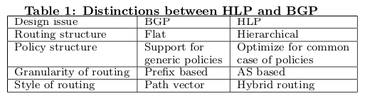

## HLP: A Next Generation Inter-domain Routing Protocal

### Abstract

### 1. Intro

This paper describes a hybrid linkstate and pathector protocol called HLP as an alternative to BGP that has vastly better scalability, isolation and **convergence properties（收敛性）**.

BGP suffers from **inherent （固有）**algorithmic problems, including poor scalability, minimal fault isolation, and slow convergence due to uninformed path exploration.

In this paper, we explore a design point that is less extreme than BGP by proposing and evaluating a hybridlink state pathvector routing protocol, called HLP. 

### 2. Design Rationale

#### 2.1 Problem with BGP

*Scalability*: Any future inter-domain routing protocol must gracefully accommodate the ongoing growth of the Internet. BGP fails this test, as its routing state and rate of churn (the rate of routing announcements received by a given router) grow linearly with the size of the network.

*Convergence and Route Stability*: To provide reliable reachability, Internet routes should be relatively stable and, when a change is necessary, they should quickly converge to their new steady-state. However, BGP is known to suffer from significant route instabilities, route oscillations and long convergence times.

*Isolation*: No design can be robust and scalable if local faults within a network can have global impact. Unfortunately, BGP has very poor fault isolation properties.

#### 2.2 Basic Design Issues

##### 2.2.1 Routing Structure

HLP hides some path information. It does so by using the natural hierarchical routing structure defined by the typical relationships between interconnected ASs — peers, customers, and providers – and hiding the small-scale routing dynamics in one hierarchy from nodes in another hierarchy.

##### 2.2.2 Policy

**Export-rule guideline**: Do not forward routes advertised by one peer or a provider to another peer or provider.

**Route preference guideline**: Prefer customer-routes over routes advertised by peers or providers.

HLP does allow policies that do not obey these two simple rules, but it treats those as exceptions and provides additional mechanisms for supporting them. The result is a routing protocol that, in the common case, can recognize misconfigurations and limit the propagation of route advertisements.

##### 2.2.3 Routing Granularity（粒度）

Given that prefix based routing results in greater churn and larger routing tables, and yet does not usually result in differing paths, we designed HLP to route at the granularity of AS’s instead of prefixes.

##### 2.2.4 Routing Style

HLP uses a hybrid of link-state and path-vector routing. At first glance this might seem overly complex, but the hierarchical structure provides a natural way to decompose routing between the two styles; HLP uses link-state within a given hierarchy of AS’s (as specified by provider-customer relationships) and uses path-vector between hierarchies. The link-state component improves convergence and reduces churn within a hierarchy, while the path-vector component preserves global scalability by hiding internal route updates across hierarchies (thereby sacrificing global visibility).

### 3. The HLP Routing Model

#### 3.1 HLP routing structure

The design of HLP leverages the existence of a hierarchical structure in the AS topology based on provider-customer relationships.

#### 3.2 Basic Route  Propagation Model

1. **Link-state aspect of HLP**: Within each hierarchy, when an inter-AS routing event occurs, the other AS’s in the hierarchy are notified using a link-state announcement. This linkstate announcement is at the granularity of AS’s and not at the granularity of routers. Every AS maintains link-state information about the inter-AS provider-customer links within its own hierarchy (inclusive of the links above it) and updates this information upon receipt of a link-state update.

2. **Path-vector aspect of HLP:** Between hierarchies, the pathvector part of HLP is similar to BGP, where an AS propagates reachability information tagged with an AS path. The primary distinction is that the HLP uses a fragmented path vector (FPV) that contains only a portion of the AS path to the destination, rather than the entire AS path as with BGP. The FPV omits the portion of the AS path within an AS hierarchy. As the length of the FPV path has no routing significance, every FPV advertisement also carries a cost metric.

To summarize HLP’s basic routing model:

1. All AS’s maintain a link-state database of the topology in their local hierarchy.

2. The AS path in each FPV **includes（穿越）** all AS’s whose peering links were traversed, but excludes the parts of the path within the AS hierarchies.

3. All inter-AS links have a cost metric which is added to the net cost value in an FPV route advertisement.

4. HLP can model indirect peering by allowing the forwarding of route advertisements across more than one peering link.

**Theorem 1**:*In the absence of cycles in the providercustomer hierarchy, if every AS follows the HLP route propagation rules and every AS chooses a customer route if one exists, then the routing protocol is **devoid（排除）** of non-transient routing loops and the count to infinity problem.*

#### 3.3 Explicit informarion hiding using costs

The notion of comparable cost relaxes the notion of shortest path routing, and helps achieve better scalability and isolation.

In HLP, we support three forms of cost-hiding:

  (a) not propagating minor cost changes (within a threshold ∆ of previous advertised cost) of customer routes (previous AS in the path is a customer) across peering links;

  (b) not propagating minor cost changes of peer routes (previous AS in the path is a peer) to customers;

  (c) hiding the failure of one of multiple parallel peering links between a pair of AS’s. The first two cases are illustrated in figure 3, and involve cost hiding by an AS higher up in the hierarchy that the origin of the change. In the third case, the issue is local to the two AS’s, and it is entirely their own choice whether or not to advertise a cost change. We prove the following result on HLP’s cost-hiding mechanism 

**Theorem 2**: *In the absence of a cycle in the AS hierarchy, if every AS strictly adheres to the route-preference guideline, then HLP with cost hiding is devoid of non-transient routing loops and the count to infinity problem.*

#### 3.4 Handling comlex relationships

In HLP, we model all complex relationships as peer-peer links in the AS topology i.e., every complex relationship is explicitly published as a peering link.

The primary reason to do is, by treating these links as peering links, HLP emulates the behavior of BGP over these links thereby maintaining compatibility with what is status quo.

#### 3.5 Handling policy variations as exceptions

Two forms of exceptions to the default behavior:

1\. Export policy exception: An AS prefers to forward advertisements from one provider/peer to another provider/peer (except indirect peering which allows forwarding across peers).

2\. Prefer customer exception: An AS prefers a non-customer route over a customer route.

##### 3.5.1 Frequency of Exceptions

In summary, a very small fraction of Internet routes cause export-policy and prefer-customer exceptions.

##### 3.5.2 Handling export policy exceptions

Hence, an FPV announcement from a peer/provider will be propagated to the provider with the path-vector in the FPV including all the three AS’s involved in the exception.

##### 3.5.3 Handling prefer customer exceptions

To summarize, HLP supports exceptions in the following manner: any network that chooses to forward a route in violation of the constraints on a provider-customer link should model the link as a peering link (with regards to this route) and use the normal HLP propagation rules.

### 4. HLP Protocal Analysis

#### 4.1 Scaling and Isolation

To quantify the scaling and isolation aspects of HLP and compare them with BGP, we need a mechanism to analyze the routing dynamics of both protocols given the precise location and type of a routing event.

##### 4.1.1 Routeupdate Emulation Methodology

Hence, the churn improvement numbers we report (i.e., HLP churn/ BGP churn) represent a lower bound on the actual churn improvement.

The improvement in the isolation of HLP is defined as the ratio of the number of AS’s affected by an event in BGP to the number of AS’s affected in HLP.

##### 4.1.2 Costhiding: bestase analysis

*Churn Improvement*: The churn reduction in HLP is due to two factors  (a) using the AS-prefix mapping; (b) cost hiding of route updates.

*Isolation improvement:* First, in the aggregate case, we found that for 50% of links, HLP has more than a 100 fold improvement in isolation over BGP. Second, more than 80% of the events are globally visible in BGP. In comparison, more than 40% of the events trigger updates to less than 10 AS’s in HLP. This is because the level of isolation is dependent on the type of inter-AS link that underwent a failure.

The scale and isolation gains in HLP are substantial.

##### 4.1.3 Effect of Multihoming

Hence, very few AS’s (apart from top-tier AS’s) are notified of a path failure to a multi-homed customer.

##### 4.1.4 Determing the costhiding threshold

For example, in the simple case where inter-AS links are assigned uniformly in the range \[0 . . . m\], choosing a cost-hiding threshold of ∆ = m achieves the desired result. In the general case, a simple thumb-rule is to set ∆ = 2 × μ where μ is the mean inter-AS link-cost.

#### 4.2 Convergence properties

We define convergence time as the interval of time (assuming certain propagation delays along the links) it takes the entire network to reflect a particular route change, e.g.,a new route becomes available, a route has disappeared, or a route has changed.

**Theorem 3**: *For a given destination D, let k(D) represent the maximum number of peering links in any HLP route advertisement to destination D. Under the assumption that every AS adheres to the HLP route propagation rules, if an event E affects destination D, then the route updates to D triggered by event E will converge within a maximum time of O(nk(D)).**

### 5. Traffic Engineering ans Policy Support

#### 5.1 Prefixlevel route selection

**Static prefix deaggregation**: A destination AS that intends to perform inbound traffic engineering for different sub-prefixes needs to explicitly deaggregate its prefixes into sub-prefixes and publish these sub-prefixes in the (AS, prefix) mapping table.

#### 5.2 Costbased inbound traffic engineering

In HLP, this process is more explicit: an AS can manipulate the cost of its inter-AS links to achieve volume-based inbound TE. This works under the assumption that most AS’s choose routes based on cost as currently happens with BGP’s AS Path length.

Hence, we believe that M can perform fine-grained control by manipulating costs to its upstream providers.

However, the level of such control is dependent on the underlying distribution of link-costs and we intend to evaluate this more completely in future work.

#### 5.3 Policy practices: HLP vs BGP

**BGP policies not supported by HLP**: While HLP can support a variety of BGP policies, there are certain cornercase policies that it cannot.

**HLP specific policies**: HLP also enables a new set of policies. Two such policies are class based routing and cost-based routing.

### 6. HLP: A Router Perspective

#### 6.1 iHLP consistency checks

*Maintaining a communicating group*: Since routers within an AS need to act in unison, every router should maintain a communicating group of live routers within the AS. Unless an AS partitions, an AS should have only one communicating group. If it does partition, iHLP should ensure that routers in each communicating group act in unison; however each communicating group will act on its own.

*Maintaining customer-route consistency*: HLP follows the prefer-customer guideline. To implement this, iHLP needs to ensure that in the absence of exceptions, every router should choose a customer route to a destination provided one such exists. An exit-router that raises a prefer-customer exception merely withdraws its current route. In the absence of an alternate customer route, the destination is classified as an exception; otherwise, it is not.

*Maintaining link-cost consistency*: From an external view, every inter-AS link is associated with a specific cost. In the presence of multiple peering links with a neighboring AS, iHLP needs to ensure a common cost value across all routers for a peering link. We do not impose any restrictions on how to compute this common cost value.

*Maintaining route-update consistency*: All routes propagated by AS X about a destination AS D to a neighboring AS Y should satisfy (a) All announcements about D to Y should be of one kind LSAs or FPVs; (b) All LSAs for the same link should have the same cost.

#### 6.2 HLP software router implementation

##### 6.2.1 Overhead characteristics

First, the complexity of LSA processing due to the recomputation of shortest paths to destinations and our numbers match with those reported in prior OSPF studies \[26, 4\]. However, in reality, we anticipate the number of LSAs within a given second to be very small since each event (e.g., link failure) is captured within a single LSA message (unlike BGP which generates many updates due to a single event). Also, we anticipate the frequency of link-cost changes to be small e.g., as a comparison, a stub network that continuously deaggregates prefixes propagates at most one update every 30 seconds \[5\].

Second, the FPV processing rate that we can support for a hierarchy of size 20000 is at least 10 times greater than the maximum update rate observed in a BGP router today \[1\].

##### 6.2.2 Implementation lessons

First, since stub networks account for a majority of AS’s and their growth rate is higher than that of transit networks, this separation does provide improved scalability and isolation properties than BGP.

Second, we minimize the possibility of misconfigurations since many stub networks are largely unmanaged and we minimize the knobs at the disposal of these networks.

Third, routes between transit networks are relatively stable \[5\] and this stability cannot be affected by stub AS’s.

### 7. Realated Works

*New Internet architectures*: Several new Internet architectures have been proposed to address pressing problems in Internet routing.

*Changes to the BGP protocol*: HLP aims to provide improved scalability/isolation, diagnosis support, convergence and security.

### 8.Conclusions

Designing an inter-domain routing protocol is a very challenging task, in part because it is difficult to design routing systems that scale globally, and in part because the range of policies that needs to be supported is ill-defined. BGP, a specific point in the design space supports a wide range of policies at the expense of poor scalability, fault isolation and convergence properties. In designing HLP, we started from the observation that to do better than BGP, we needed to make use of information that BGP does not have. The only policy information that inherently does not suffer from serious privacy issues is that of provider-customer relationships, and this is simply because this information cannot be a secret for routing to function. Having this information available in the protocol itself led directly to the observation that in sizable parts of the AS hierarchy we could use linkstate style algorithms, which solve many of the problems exhibited by BGP. But between these regions, link-state is not viable due to policy-privacy issues, which forces us towards a hybrid link-state/path-vector solution. Separation of prefix-binding from topology discovery is a further step towards reducing routing protocol overhead, and also towards using appropriate security solutions for the different parts of the problem. The resulting protocol has many very desirable properties, including fast convergence, good fault isolation, lower routing table churn, and inherently better security and robustness.

However, just because a protocol has good routing properties does not mean that it solves the problem in a way that is economically viable for ISPs. Unfortunately no single person knows the big picture of what an inter-domain policy routing protocol needs to do in reality. This makes evaluation especially hard. In this paper we have tried to examine not only the basic properties of convergence, fault isolation and scalability, but also examine many of the ways BGP is used with the aim of understanding how well HLP solves the same tasks. Our present level of understanding is that HLP measures up rather well against BGP in a large range of deployment scenarios, but only by exposing the design to a wide range of ISPs and router vendors will we learn the full story.

We are under no illusion that HLP is poised to replace BGP any time soon, but only by putting a stake in the ground can we hope to stimulate informed debate about both the requirements for and the design of future interdomain routing.
