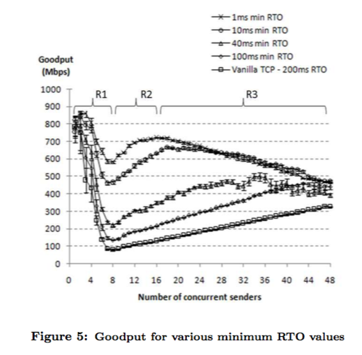
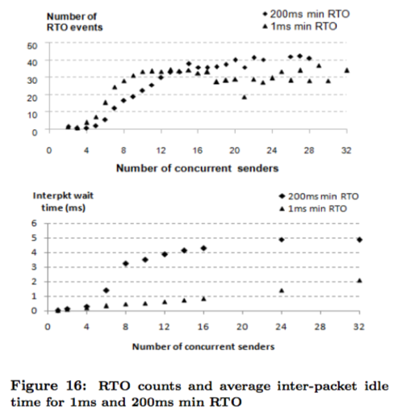

## Understanding TCP Incast Throughput Collapse in Datacenter Networks

### Abstract

- TCP Throughput Collapse, also known as Incast, is a patho- logical behavior of TCP that results in gross under-utilization of link capacity in certain **many-to-one**（多对一通信） communication pat- terns.

- 

- An analytical model: 

  - Observed Incast symptoms

  - Identify contributory factors

  - Explore the efficacy of solutions

### 1. Intro

- Internet datacenters support a myriad of services and applications. Vast majority of datacenters use TCP for communication between nodes.

- **The unique workloads, scale, and environment of the Internet datacenter violate the WAN assumptions on which TCP was originally designed.**

- The incast pattern potentially arises in many typical datacenter applications.

- A thorough  solution:

  - Reproduce the results in prior work in our own experimental testbeds and offer another demonstration of the **generality** of Incast.

  - Propose a quantitative model that accounts for some of the observed Incast behavior and provide qualitative refinements that give **plausible（似是而非） explanations** for the other symptoms.

  - Implement several **minor（次要）, intuitive（直观） modifications** to the TCP stack in Linux.

### 2. Background

- The Incast pathology（病理）

  - **Reducing the mini- mum value of the retransmission timeout (RTO) timer** from the default 200ms to 200μs, however  most systems lack the high-resolution timers required for such low RTO values.

  - Switches and routers with large buffers are **expensive**, and even large buffers may be filled up quickly with ever higher speed links.

  - **Application level solutions** are possible, e.g. global scheduling of requests, but requires potentially complex modifications to many key applications that use TCP.

- A key shortcoming of the prior work is the **lack of an analytical model to understand the Incast phenomenon**.

- **Cost concerns and the preference for existing technology** mean that solutions like Infiniband and custom transport protocols are less attractive. 

- Hence our focus on **TCP solutions**.

### 3. Methodology

#### 3.1 Workload

- Inspired by **distributed storage applications and bulk block transfers in batch processing tasks** such as MapReduce.

- The metric of merit（度量标准） is application-level throughput (**goodput**), given by the total bytes received from all senders divided by the finishing time of the last sender.

#### 3.2 Testbed and Tools

- *2* platforms

- Combination of tools:

  - tcpdump and tcptrac

  - analysis tool in Java to fill up gaps

#### 3.3 Exploratory Approach

- Priority was to understand the Incast problem, instead of implementing and evaluating the widest range of possible solutions.

### 4. Initial Findings

- Each RTO event lasts for 200ms, the **default minimum RTO timer value for the Linux TCP stack**.

- These observations inspired us to attempt a series of minor, intuitive modifications to the Linux kernel.

- Modifications:

  - Decreasing the minimum TCP RTO timer from the default 200ms

  - Randomizing the minimum TCP RTO timer value

  - Setting a smaller multiplier for the RTO exponential back off

  - Using a randomized multiplier for the RTO exponential back off

- There was another intuitive modification that we **did not attempt** - randomize each the timer value of each RTO as they occur.

- Many modifications are **unhelpful** including **randonmize the minimum and initial RTO timer value**.

- Most **promising** modification is to **reduce the minimum RTO timer value**.

### 5. Analysis In Depth

#### 5.1 Different RTO Timers

- *Smaller* minimum RTO timer values: 

  - larger values for the initial goodput minimum

  - faster goodput “recovery” between the initial goodput minimum and the subsequent goodput local maxi- mum

- *Larger* minimum RTO timer values:

  - the goodput local maximum occurs at a larger number of senders

- The initial goodput minimum oc- curs at the same number of senders, **regardless of** minimum RTO timer values.

#### 5.2 Delayed ACKs and High Resolution Timers

- *2*  mechanisms:

  - Modify the OS to use high resolution timers: facilitate RTO timers with the **granularity（粒度）**of hundreds of  microseconds

  - Turn off delayef ACKs wherever possible:  disabling de- layed ACKs is expected to improve performance for RTO timer values of 40ms or less

- The increased number of smoothed RTT spikes represent more frequent, unnecessary congestion timeout events, another piece of evidence that indicates that **the congestion window is being over-driven when delay ACKs are turned off**.

#### 5.3 Workload and Testbed

- The **variable-fragment workload** does not fully reflect the complex dynamics of the incast pathology.

- First, whatever sub-optimal behavior we see with regard to delayed ACKs is **workload independent**. 

- Second, because our results are different from [11\], and we ensured that all application and transport level parameters are **reproduced**, the different results suggest that the **different network environment associated with a differ- ent testbed** would **play a part**. 

- Also, in agreement with the observation in Figure 6, the sub-optimal behavior for 200us RTO value is **independent** of the presence or absence of de- layed ACKs.

### 6. Quantitative Models

#### 6.1 Model Description

- *2* critical insights into potential TCP fixes to help address the Incast problem:
  - For large RTO timer values, **reducing the RTO timer** value is a first-order mitigation. 

  - For smaller RTO timer values, **intelligently controlling the inter-packet wait time** becomes crucial.

#### 6.2 Qualitative Refinements

- ##### Several elements to the refinements:

1. As the number of senders increase, the number of RTO events per sender increases. **Beyond a certain number of senders**, the number of RTO events is **constant**.

2. When a network resource becomes saturated, it is **saturated at the same time for all senders.**

3. **After a congestion event, the senders enter the TCP RTO state**. The RTO timer expires at each sender with a uniform distribution in time and a constant delay after the congestion event.

4. T（T is the width of the uniform distribution in time） increases as the number of senders increases. However, T is bounded.

- ##### Three distinct regions in the goodput graph in Figure 5 as follows:

1. **Initial goodput collapse**:  The number of RTO events increases and the number of senders increases.

2. **Goodput recovery**: The effective value of the RTO timer would be reduced as the number of senders increases.

3. **Goodput decreases again**:  As the number of senders increases, T would eventually become comparable or even larger than the value of RTO timers.  A possible consequence is increased inter-packet wait time, leading to the behavior in Figure 16, and a gradual decrease in goodput.

- 

- ##### Explain details in goodput graph:

1. A smaller minimum RTO timer value means larger goodput values for the initial minimum.

   Explanation: The default TCP RTO timer value is much larger than the network round trip time in datacenters. Hence, **smaller RTO timers mean that the impact of RTO events is less severe.**

2. The initial goodput minimum occurs at the same number of senders, regardless of the value of the min- imum RTO timer.

   Explanation: The initial goodput minimum roughly corresponds to the transition point in R in Figure 16. The transition point is at roughly the same number of senders for all RTO timer values. **Hence the goodput minimum is roughly the same for all RTO timer values.**

3. The second order goodput peak occurs at a higher number of senders for a larger RTO timer value.

   Explanation: The second order maximum corresponds to the trade-off between incremental goodput increases with more senders and increases of T causing interference with retransmissions. **The cross over point depends on both the number of senders and the RTO timer value.** In particular, larger RTO timer values would require larger T for the effects to cross over. If the increase in T depends on the number of senders only, then the second order goodput peak would occur at more senders for larger RTO timer values. 

4. The smaller the RTO timer values, the faster the rate of recovery between the goodput minimum and the second order goodput maximum.

   Explanation: For smaller RTO timer values, the same increase in T will have a larger mitigating effect. **Hence, as the number of senders increases, the same increase in T will result in a faster increase in the goodput for smaller RTO timer values.**

5. After the second order goodput maximum, the slope（坡） of goodput decrease is the same for different RTO timer values.

   Explanation: **When T becomes comparable or larger than the RTO timer value, the amount of interference between retransmits after RTO and transmissions before RTO no longer depends on the value of the RTO timer.** The amount of interference increases with the number of senders at a fixed rate, leading to a fixed rate of goodput degradation after the second order goodput maximum.

### 7\. Conclusions and Future Work

##### For a better understing of the dynamics of Incast:

- [ ] Conducte experiments on a configurable network testbed, enabling fine-grained control over end hosts and the network.

- [ ]  Based on analysis of empirical data, we account for the dif- ference between our observations and that in related work. 

- [ ] Propose a simple mathematical model to explain some of the observed trends.

##### Future work:

- [ ] Extend the model to quantitatively for all goodput trends, to make TCP protocal more general and robust

- [ ]  The first step in this design process would be to **narrow down the range of TCP variables of interest**. Some variables are inter-dependent with others, some variables may have no impact on goodput at all.

- [ ] **Employ machine learning** to help to identify the most important control variables to examine.

- [ ]  If we are able to **identify a small set of core parameters of interest**, we may also be able to construct cor- relations between the parameters. These correlations, in turn, may allow us to **develop control models that fundamentally depart from the ACK-clocked nature of TCP.**

- [ ] **Evaluate our mechanisms** for different applications, environments, network equipment, and network topologies to validate the fixs author proposed.

- [ ] Investigate the associated tradeoffs, and evaluate our solutions using real life workloads.

- [ ]  In the long term, we will also use our understanding to **construct a detection signature or benchmark** that would be used to **assess whether specific applications or workloads are affected by Incast**.

